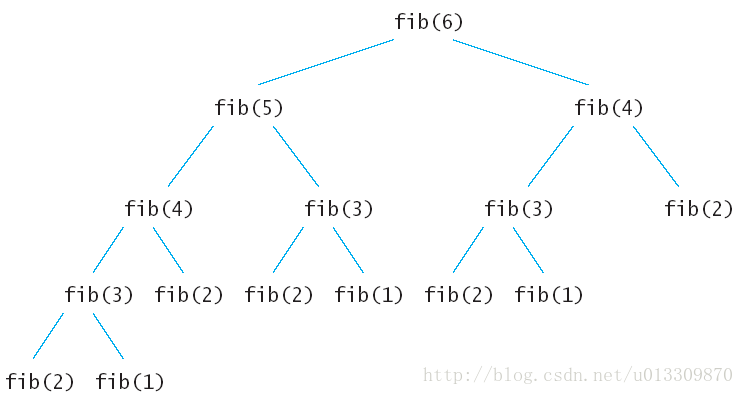

[TOC]

#### 动态规划（Dynamic Programming）

- 通俗的讲，就是记住求过的解来节省时间
- 记住求解的方式有两种：
  - 自顶向下的备忘录法：将求出的解用数组保存起来，下次再用时，直接取
  - 自底向上的动态规划：先计算子问题，再由子问题计算父问题
- 一般来说由于备忘录方式的动态规划方法使用了递归，递归的时候会产生额外的开销，使用自底向上的动态规划方法要比备忘录方法好
- 动态规划常常适用于有重叠子问题和最优子结构性质的问题，动态规划方法所耗时间往往远少于朴素解法

例如：计算Fibonacci(n)



这样会有多个数据重复计算

解决算法：

- 自顶向下的备忘录法

```python
# 动态规划 - 自顶向下的备忘录法：将求出的解用数组保存起来，下次再用时，直接取
def fib2(num, results=None):
    if results is None:
        results = {}
    assert num > 0
    if num in (1, 2):
        return 1
    try:
        return results[num]
    except KeyError:
        results[num] = fib2(num-1, results) + fib2(num-2, results)
        return results[num]
```

- 自底向上

```python
# 动态规划 - 自底向上的动态规划：先计算子问题，再由子问题计算父问题
def fib3(num):
    assert num > 0
    results = {1: 1, 2: 1}
    for i in range(3, num+1):
        results[i] = results[i-1] + results[i-2]
    return results[num]


# 上面的函数fib3使用了results[1] ~ results[num]个空间
# 但实际参与循环的只有2个值，因此空间上可进一步压缩
def fib4(num):
    """ fib(1)=1 fib(2)=1 ... fib(n)=fib(n-1) + fib(n-2) """
    a, b = 1, 1
    for _ in range(num - 1):
        a, b = b, a+b
    return a
```

- [参考博客](https://blog.csdn.net/u013309870/article/details/75193592)


#### @contextmanager

- 实现 with 结构

- 例如：执行顺序为，从 timer() 的 try 块进入，执行到 yield，接着执行 with 下方的 print 语句，最后进入 finally 块，故这种写法，可以使语句 #3 执行后，打印出其执行的效率

  ```python
  @contextmanager
  def timer():
      try:
          start = perf_counter()	#1
          yield	#2
      finally:
          end = perf_counter()	#4
          print(f'{end - start}秒')	#5
          
  def main():
      with timer():
          print(f'20: {fib(20)}')	#3
  ```

- [参考博客](https://blog.csdn.net/qq_30242609/article/details/52926646)