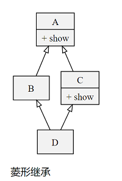

#### 面向对象编程

##### 三大支柱

- 封装
- 继承
- 多态

##### 类与类之间的关系

- is-a关系：继承
- has-a关系：关联 / 聚合 / 合成
- use-a关系：依赖

##### 面向对象设计原则（仅概念）

- 单一职责原则 （**S**RP）- 一个类只做该做的事情（类的设计要高内聚）
- 开闭原则 （**O**CP）- 软件实体应该对扩展开发对修改关闭
- 依赖倒转原则（DIP）- 面向抽象编程（在弱类型语言中已经被弱化）
- 里氏替换原则（**L**SP） - 任何时候可以用子类对象替换掉父类对象
- 接口隔离原则（**I**SP）- 接口要小而专不要大而全（Python中没有接口的概念）
- 合成聚合复用原则（CARP） - 优先使用强关联关系而不是继承关系复用代码
- 最少知识原则（迪米特法则，Lo**D**）- 不要给没有必然联系的对象发消息

- 说明：上面加粗的字母放在一起称为面向对象的**SOLID**原则。
- 不明白

##### GoF 设计模式（仅概念）

- 创建型模式：单例、工厂、建造者、原型
- 结构型模式：适配器、门面（外观）、代理
- 行为型模式：迭代器、观察者、状态、策略
- 不明白


#### 定义抽象类

- ```python
  # 通过指定metaclass=ABCMeta，使其成为抽象基类
  class Employee(metaclass=ABCMeta):
  """员工，抽象类"""
  
  def __init__(self, name):
  self.name = name
  
  @abstractmethod
  def get_salary(self):
  pass
  ```

- 工厂？不是很懂

  ``` python
  class EmployeeFactory(object):
      """创建员工的工厂（工厂模式 - 通过工厂实现对象使用者和对象之间的解耦合）"""
  
      @staticmethod
      def create(emp_type: str, *args, **kwargs):
          if 'M' == emp_type:
              emp = Manager(*args, **kwargs)
          elif 'P' == emp_type:
              emp = Programmer(*args, **kwargs)
          elif 'S' == emp_type:
              emp = Salesman(*args, **kwargs)
          else:
              raise ValueError(f'{emp_type}：没有这种类型的员工')
          return emp
  ```


#### 枚举

- ```python
  # 默认情况下，不同的成员值允许相同。但是两个相同值的成员，第二个成员的名称被视作第一个成员的别名
  # @unique 限制定义枚举时，不能定义相同值的成员
  @unique
  class Suite(Enum):
      """ 花色 """
  
      DIAMOND, CLUB, HEART, SPADE = range(4)
  
      def __lt__(self, other):
          return self.value < other.value
  ```


#### 随机打乱列表顺序

```python
random.shuffle(self.cards)  # 随机打乱列表顺序
```

```python
# 随机打乱传入的列表的顺序
def my_shuffle(my_list: list):
    n = len(my_list)
    temp = None
    for i in range(n)[::-1]:    # 使列表反转
        temp = randint(0, i)    # a <= N <= b.
        my_list[i], my_list[temp] = my_list[temp], my_list[i]
```

#### tuple比较大小规则

```python
tuple比较大小规则：从第一个开始比较，一旦出现结果就停止，如：

In [1]: (1, 1) < (1, 5)
Out[1]: True

In [2]: (2, 1) < (1, 5)
Out[2]: False
```


#### python mix-in

- [参考原文](http://www.bjhee.com/python-mixin.html)

- 从语法上看，通过多重继承实现如 Java 中接口的功能

- 从含义上看依然遵循单继承的原则

- 使用 mix-in 注意

  - 首先它必须表示某一种功能，而不是某个物品，如同Java中的Runnable，Callable等
  - 其次它必须责任单一，如果有多个功能，那就写多个Mix in类
  - 然后，它不依赖于子类的实现
  - 最后，子类即便没有继承这个Mix in类，也照样可以工作，就是缺少了某个功能。

- 例子：

  ```python
  class Vehicle(object):
      pass
   
  class PlaneMixin(object):
      def fly(self):
          print('I am flying')
   
  class Airplane(Vehicle, PlaneMixin):
      pass
  ```


#### `__slots__`属性

- Python允许在定义class的时候，定义一个特殊的`__slots__`变量，来限制该class实例能添加的属性

- ```python
  class Student(object):
      __slots__ = ('name', 'age') # 用tuple定义允许绑定的属性名称
  ```

- ```sh
  >>> s.score = 99 # 绑定属性'score'
  Traceback (most recent call last):
    File "<stdin>", line 1, in <module>
  AttributeError: 'Student' object has no attribute 'score'
  ```


#### python MRO

- Method Resolution Order

##### 菱形继承



##### C3算法

- python3 采用 C3 MRO
- 禁止创建具有二义性的继承关系
- 结果上看，类似于**广度优先搜索**
- 算法比较复杂，似懂非懂，具体参考[博文](https://hanjianwei.com/2013/07/25/python-mro/)

